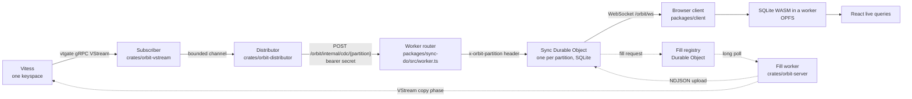

# Architecture

## Purpose

Orbit is a general-purpose sync engine. It moves committed row changes from a Vitess database to browsers. Each browser holds a local SQLite database. React components read live queries from that database.

The engine has three runtimes:

- A Rust server (`crates/orbit-server`) that reads the database change stream.
- A Cloudflare Worker with Durable Objects (`packages/sync-do`) that caches each partition.
- A browser client (`packages/client`) that keeps a local replica and serves queries.

All three runtimes load the same compiled sync schema. Its `schema_hash` is the identity that every boundary checks.

## Data flow



The live path runs from left to right. The dotted path is the demand fill. A Durable Object uses the fill to load a table for its partition the first time a client asks for it. See [bootstrap.md](bootstrap.md).

## The Rust server

The binary `orbit-server` has four subcommands:

```bash
orbit-server run
orbit-server schema introspect|validate
orbit-server checkpoint show|reset
orbit-server quarantine list|replay|drop
```

`orbit-server run` starts these tasks in one process:

- The subscriber. It opens a `VStream` on vtgate with one `select * from T` rule per synced table. It assembles `BEGIN`, `FIELD`, `ROW`, `VGTID` and `COMMIT` events into one `SourceTransaction` per commit. It projects each row onto the sync schema. It sends items into a bounded channel with capacity 256.
- The distributor. It routes each transaction to logical partitions. It batches up to 200 transactions or 4 MiB per delivery. It delivers one batch at a time per partition, with at most 32 deliveries in flight. It persists the checkpoint in SQLite. See [checkpoints.md](checkpoints.md).
- The fill worker. It long-polls the Worker for fill requests and runs copy-phase fills. It runs at most `FILL_CONCURRENCY` fills at the same time (default 4). `--disable-fills` turns it off.
- A Prometheus metrics endpoint at `METRICS_ADDR` (default `127.0.0.1:9464`).
- A status log line every 10 seconds.

The server reads its configuration from flags or environment variables. The important ones are `VITESS_GRPC_URI`, `VITESS_USERNAME`, `VITESS_PASSWORD`, `SYNC_SCHEMA_PATH`, `STATE_PATH`, `WORKER_URL` and `WORKER_SECRET`.

The vtgate connection (`crates/orbit-vstream/src/client.rs`) uses TLS for `https://` URIs, HTTP basic auth when credentials are set, and HTTP/2 keepalive.

## The Worker and the Durable Objects

The Worker router (`packages/sync-do/src/worker.ts`) mounts under a prefix, `/orbit` by default. It serves these routes:

- `GET /orbit/ws?partition=P&token=T`: the client WebSocket.
- `POST /orbit/internal/cdc/:partition`: batch delivery from the distributor.
- `GET /orbit/internal/fills/next?wait=S`: the fill worker long poll.
- `POST /orbit/internal/fills/:fillId`: the fill upload.
- `GET /orbit/internal/status/:partition` and `POST /orbit/internal/reset/:partition`: operator endpoints.

Internal routes need a bearer token equal to the internal secret. The Worker compares it in constant time.

The client route runs the application `Authorizer` first. The built-in `hmacAuthorizer` verifies an HMAC-SHA-256 token with `sub`, `partitions` and `exp`. The Worker then forwards the request to the Durable Object for that partition. A client can never choose a Durable Object by itself. See [placement.md](placement.md).

The Sync Durable Object (`packages/sync-do/src/do.ts`) wraps the engine core (`packages/sync-do/src/core/engine.ts`). The core is synchronous code over a `SqlDriver`. Every core operation runs inside one SQLite transaction (`ctx.storage.transactionSync`). The Durable Object adds transport, hibernating WebSockets, session bookkeeping and alarms.

The core keeps these tables in the Durable Object SQLite database:

| Table           | Purpose                                          |
| --------------- | ------------------------------------------------ |
| `meta`          | schema hash, partition, epoch, `applied_seq`     |
| `scopes`        | fill state per table: filling or live            |
| `held`          | row changes received while a scope was filling   |
| `seq_log`       | recent `(seq, gtid)` pairs for duplicate checks  |
| `subscriptions` | materialized queries by canonical key            |
| `membership`    | `(subscription, table, key)` rows in each result |
| `fills`         | outstanding fill requests                        |
| `t_<table>`     | the relational cache                             |

The fill registry Durable Object (`packages/sync-do/src/registry-do.ts`) is one object per deployment. It queues fill requests and serves them to the fill worker.

## The browser client

`createOrbitClient` (`packages/client/src/client.ts`) builds a `ClientEngine`. The engine owns:

- A `LocalStore` over an `AsyncSqlDriver`. The default driver runs SQLite WASM in a dedicated worker with the `opfs-sahpool` VFS. When OPFS is locked or unsupported, the client falls back to an in-memory database.
- A WebSocket connection with reconnect, backoff and a ping heartbeat.
- The live query registry. Identical queries share one subscription. A live query is a named query call (`queries.<name>(args)`); the client resolves it locally for an immediate result and adopts the server's resolution when it arrives.
- The mutation log and the optimistic overlay. `client.mutate.<name>(args)` runs a mutator against the local cache at once, appends it to a persistent log, and pushes the log to the application's endpoint. Confirmation arrives through sync, in the same transaction as the mutation's effects (see [mutations.md](mutations.md)).

`useLiveQuery` and `useSyncStatus` (`packages/client/src/react.ts`) expose the engine to React through `useSyncExternalStore`.

## Named queries and mutators

Reads and writes are both defined once by the application, in shared code:

- `defineQueries` (`@orbit/query`) names every query a client may run. The Durable Object resolves a name with the session's identity, so authorization is the resolver, not a rule engine.
- `defineMutators` (`@orbit/mutators`) names every write. The same mutator runs in the browser (optimistic) and on the server (authoritative, `@orbit/mutators/server`).

The engine keeps no application logic; it materializes whatever the resolver returns and syncs whatever the mutator committed.

## The shared schema artifact

An application describes what to sync with `defineSyncSchema` (`packages/schema/src/define.ts`) over introspected table metadata. `compileSyncSchema` turns the definition into the `SyncSchema` artifact and computes `schema_hash` as SHA-256 over canonical JSON. The Rust crate `orbit-protocol` validates the same artifact with `SyncSchema::validate`.

The protocol types are defined once in Rust. `orbit-protocol` exports a JSON Schema document to `schema/protocol.schema.json`. `tools/codegen` generates the Effect `Schema` definitions in `packages/protocol/src/generated/protocol.gen.ts`. A test fails when the checked-in JSON Schema is stale.

Two protocol versions exist:

- `INTERNAL_PROTOCOL_VERSION` (1) for the distributor to Durable Object protocol.
- `CLIENT_PROTOCOL_VERSION` (1) for the WebSocket protocol.

Both ends reject a mismatch explicitly.

## Repository map

- `crates/orbit-gtid`: MySQL GTID set parsing, containment and single-step diffs.
- `crates/orbit-protocol`: schema, CDC, fill and error types.
- `crates/orbit-vstream`: vtgate client, decoding, normalization, checkpoints, subscriber, fills.
- `crates/orbit-distributor`: routing, state store, delivery, distributor loop.
- `crates/orbit-server`: the binary, CLI and fill worker.
- `packages/protocol`: generated protocol types, query AST, client protocol.
- `packages/schema`: definition DSL, compiler, local DDL, runtime helpers.
- `packages/query`: query planner and SQLite compiler.
- `packages/sync-do`: Worker router, Durable Objects, engine core.
- `packages/client`: browser client and React bindings.

## Related documents

- [partitioning.md](partitioning.md): how rows map to logical partitions.
- [placement.md](placement.md): how partitions map to Durable Objects.
- [checkpoints.md](checkpoints.md): resume positions and epochs.
- [bootstrap.md](bootstrap.md): demand fills and the hold-and-skip rule.
- [ivm.md](ivm.md): incremental maintenance of subscriptions.
- [consistency-invariants.md](consistency-invariants.md): the guarantees and their mechanisms.
- [failure-model.md](failure-model.md): failures and responses.
